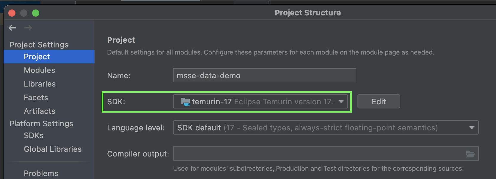
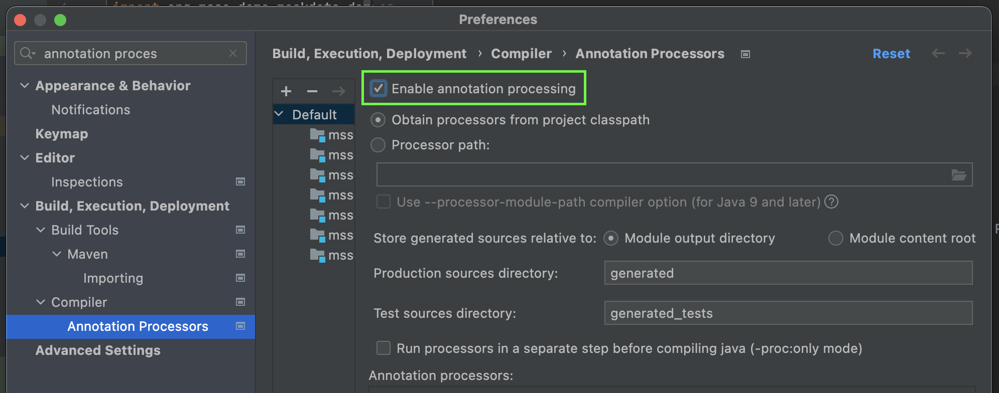

# Prerequisites

## Git

You will need Git to clone this repository. Follow the [getting started guide](https://git-scm.com/book/en/v2/Getting-Started-Installing-Git) to complete your installation.

## Java 21

You can install Java 21 however you'd like, but SDKMAN is a tool that makes installing and switching between versions a breeze.

1) [Install SDKMAN!](https://sdkman.io/install)
    - Tip: Add `source "$HOME/.sdkman/bin/sdkman-init.sh"` to your bash config file so that the source command is run each time the terminal starts up.
2) Install Java 21 via SDKMAN!
    ```bash
    sdk install java 21.0.5-zulu
    sdk use java 21.0.5-zulu
    ```

## Docker

To run any of the local docker clusters, you must first install and start Docker.

https://docs.docker.com/get-docker/

* **📣 ATTN LINUX USERS:** you must also run through these steps -> https://docs.docker.com/engine/install/linux-postinstall/   
* **📣 ATTN WINDOWS USERS:** you must be running WSL2 -> https://docs.docker.com/desktop/wsl/

## IDE

> Only required if you're doing development on `data-demo`

[IntelliJ CE](https://www.jetbrains.com/idea/download/#section=mac) is recommended, but use what you're comfortable with.

### Project SDK Configuration

> Only required if you're doing development on `data-demo`

Once you've opened the project in your IDE of choice, ensure the SDK is aligned with your Java 21 installation.



### Enable Annotation Processors for Lombok

> Only required if you're doing development on `data-demo`

Lombok is a tool that helps remove boilerplate in Java applications. Lombok is utilized in this project, so you must enabled annotation processors for Lombok to work.



_[Lombok Docs](https://projectlombok.org/)_

## `jq` (optional)

`jq` is a command line tool that can format (and do many other things) JSON responses. It is really only needed if you plan to run the mockdata-api and call the API via curl.

```bash
# example usage of jq 
curl -X POST localhost:8080/customers | jq
```

https://stedolan.github.io/jq/download/
