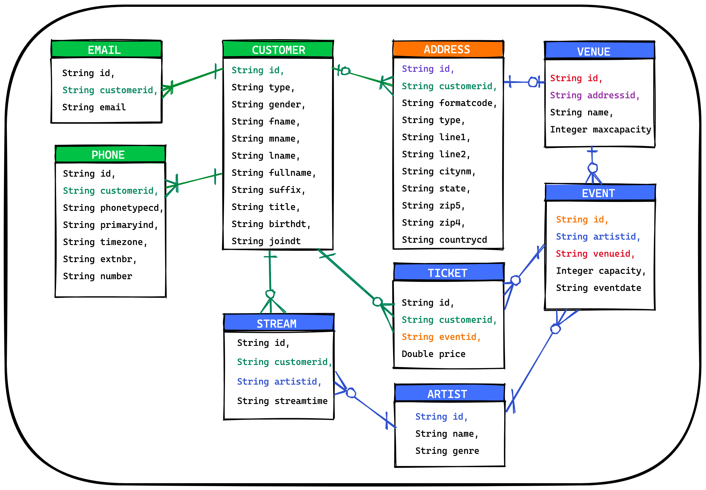

# DATA DEMO

The Data Demo [generates fake data](https://fakerjs.dev/) aligned with the ERD below.

The Data Demo can throw data into the following environments -

1) Local Postgres (Docker)
2) Local Kafka (Docker)
3) Local Postgres -> Kafka Connect -> Kafka (Docker)
4) Confluent Cloud ([tf-ccloud](./tf-ccloud/README.md))

For more details on running the Data Demo, jump ahead to the [getting started section](#getting-started).



## Environment Prerequisites

### IntelliJ CE

https://www.jetbrains.com/idea/download/#section=mac

_Feel free to use another IDE, but IntelliJ has become the industry defacto IDE._

### Java 17 (via SDKMAN!)

You can install Java 17 however you'd like, but SDKMAN is a tool that makes installing and switching between versions a breeze.

1) [Install SDKMAN!](https://sdkman.io/install)
2) Install Java 17 via SDKMAN!
    ```bash
    sdk install java 17.0.2-tem
    sdk use java 17.0.2-tem
    ```

### Set Project SDK

Update the SDK in your IDE to align with your Java 17 installation.


### Enable Annotation Processors for Lombok

Lombok is a tool that helps remove boilerplate in Java applications. Lombok is utilized in this project, so you must enabled annotation processors for Lombok to work.


_[Lombok Docs](https://projectlombok.org/)_

### Docker

If you plan to run the [Local Docker Environment](#local-docker-environment), you must first install and start Docker.

https://docs.docker.com/get-docker/

### `jq` (optional)

`jq` is a command line tool that can format (and do many other things) JSON responses. It is really only needed if you plan to run the mockdata-api and call the API via curl.

```bash
# example usage of jq 
curl -X POST localhost:8080/customers | jq
```

https://stedolan.github.io/jq/download/

## Local Docker Environment

1. Start ancillary services (PostgreSQL, Kafka, etc)

```bash
# `docker-compose` gradle plugin is used to start services

# POSTGRESQL
./gradlew postgresComposeUp
./gradlew postgresComposeDown
./gradlew postgresComposeDownForced

# pgAdmin4 (Postgres Exploration UI) available at `http://localhost:5433`
# pgAdmin4 username: root@email.com
# pgAdmin4 password: root
# pgAdmin4 postgres database password: postgres

# KAFKA
./gradlew kafkaComposeUp
./gradlew kafkaComposeDown
./gradlew kafkaComposeDownForced

# KPow (Kafka Exploration UI) available at `http://localhost:3000`

# EVERYTHING -- helpful if running Postgres with Connector publishing to Kafka
./gradlew fullComposeUp
./gradlew fullComposeDown
./gradlew fullComposeDownForced
```

If you want to run the OpenTelemetry stack and enable distributed tracing, start up the tracing services (Jaeger).

This command is run separate from the above commands that start postgres/kafka. The networking between the two docker compose files is configured to allow them to communicate.

```bash
./gradlew tracingComposeUp
./gradlew tracingComposeDown
./gradlew tracingComposeDownForced

# Jaeger UI available at `http://localhost:16686`
```

2. Validate Docker Startup
   1. Postgres:
      1. pgAdmin4 (Postgres Exploration UI) available at `http://localhost:5433`
         1. username: `root@email.com` 
         2. password: `root` 
         3. After logging in, it will prompt for postgres database password: `postgres`
            1. If it prompts for username, it's `postgres`.
   2. Kafka:
      1. KPow (Kafka Exploration UI) available at `http://localhost:3000`
   3. Tracing (If observability stack was started)
      1. Jaeger (Tracing UI) available at `http://localhost:16686`

3. Set `runtimeMode` and `tracingEnabled` depending on which services you started in step 1.

These properties are located in the project's [root gradle.properties](./gradle.properties) file.

```properties
# options: postgres, kafka
runtimeMode=postgres

# options: true, false
tracingEnabled=false
```

3. Configure Initial Load Volume (if running the Daemon)

If you're running the Daemon, you can also configure the amount of data you would like to be initially loaded.

These properties are located in the project's [root gradle.properties](./gradle.properties) file.

```properties
initialLoadCustomers=100
initialLoadArtists=200
initialLoadVenues=50
initialLoadEvents=100
initialLoadTickets=1000
initialLoadStreams=1000
```

4. Run the API or Daemon

```bash
# runs the Mock Data API
./gradlew bootRunAPI

# runs the Mock Data Daemon
./gradlew bootRunDaemon
```

5. If running the API, send a sample request.

```bash
# remove jq if you don't have it installed, jq will just help format the response nicely in your terminal
curl -X POST localhost:8080/customers | jq
```

For the full request collection, import the [Insomnia Collection](./assets/DataDemo_Insomnia_2022-10-20.json).

## Confluent Cloud Environment

If you are running the project pointed at Confluent Cloud you will first need to provision the environment using Terraform.

1) Provision Confluent Cloud Environment - see the [tf-ccloud readme](./tf-ccloud/README.md) for more details.
2) After the environment is provisioned, configure the bootstrap-servers, api-key, and api-secret
   ```bash
   terraform output resource-ids
   
   export CONFLUENT_CLOUD_CLUSTER_ID="lkc-r556np"
   export CONFLUENT_CLOUD_API_KEY="***REDACTED***"
   export CONFLUENT_CLOUD_API_SECRET="***REDACTED***"
   ```
3) Update `runtimeMode` to `kafka-cloud` in the [root gradle.properties](./gradle.properties).
4) Configure Initial Load Volume (if running the Daemon) in the [root gradle.properties](./gradle.properties) file.
   ```properties
   initialLoadCustomers=100
   initialLoadArtists=200
   initialLoadVenues=50
   initialLoadEvents=100
   initialLoadTickets=1000
   initialLoadStreams=1000
   ```
5) Run the daemon (`./gradlew bootRunDaemon`) OR the API (`./gradlew bootRunApi)`
   - If running the API, there is an [insomnia export](./assets/DataDemo_Insomnia_2022-10-20.json) you can use to get started 

## Troubleshooting

### Invalid Java Version

The following error is likely the cause of not having Java 17 installed.

```bash
> error: invalid source release: 17
```

## Stream Processing Scenarios

The following scenarios can be accomplished using the data within this project.

1) Draw the topology.
2) Implement the topology.

### MOST STREAMED ARTISTS

Context: A Customer streams (listens to) an artist.

Goals:
- Find the top 3 streamed artists across all customers.
- Find the top 3 streamed artists for each customer.
- BONUS) Group the customers that have the same top streamed artist.

### SOLD OUT EVENT

Context: Artists have events and customers book tickets to an event. Each event has a capacity (max tickets).

Goals:
- Alert when an event is within 10% of max capacity.
- Alert when an event is sold out.
- BONUS) Alert the event artist's top streamers when an event is created.

### MUST SEE VENUE

Context: Artists have events at a venue.

Goals:
- Find the venue that has hosted the most events.
- Find the venue that has hosted the most customers.

### SUGGESTED EVENTS - GENRE

Context: Customers stream artists and each artist has a genre.

Goals:
- Alert customer when an event is created in their most streamed genre.
- BONUS) Alert customer when popular* events are created in their most streamed genre.
   - *popular: within 10% max capacity

### SUGGESTED EVENTS - LOCATION

Context: Customers have an address that indicates their location.

Goals:
- Find all tickets purchased by customers in each zipcode.
- BONUS) Alert customer when customers in their zipcode are buying tickets to a popular* event. 
   - *popular: within 10% max capacity
