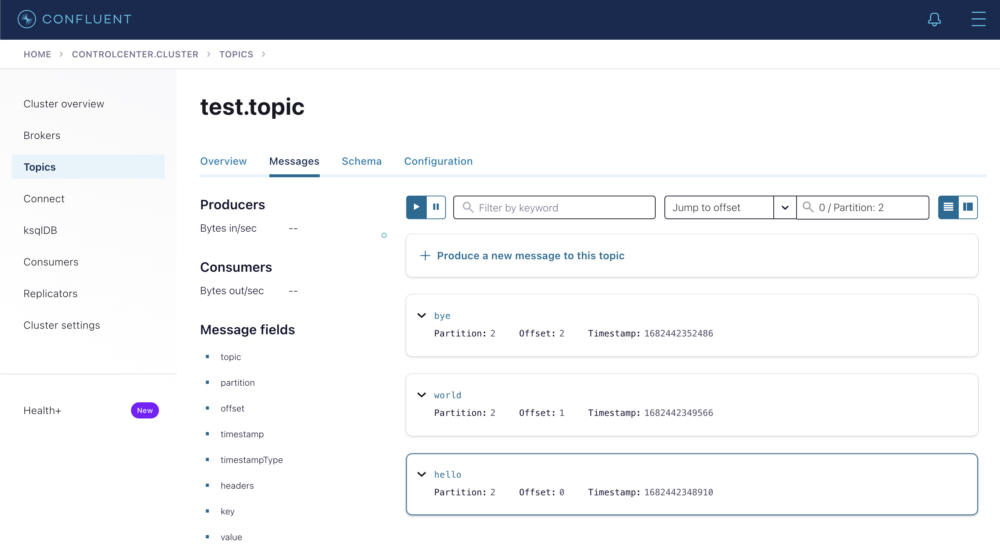

# Hands On: Introduction to Kafka

## Goals

1. Clone data-demo
2. Start Local Kafka (Confluent) Cluster
3. Create Topic, Produce, Consume
4. Run data-demo & produce mock data

## Getting Started

### Start Local Kafka Cluster

1. Clone the [data-demo](https://github.com/schroedermatt/data-demo) repository

```bash
git clone https://github.com/schroedermatt/data-demo

cd data-demo
```

2. Start Docker (if not already started)
3. Start [Kafka Stack](https://github.com/schroedermatt/data-demo/blob/main/kafka/local/cluster/docker-compose-confluent.yml)
    - This leverages the [`docker-compose` Gradle plugin](https://github.com/avast/gradle-docker-compose-plugin) ([configuration](https://github.com/schroedermatt/data-demo/blob/main/build.gradle#L47-L53))

```bash
# run from root dir of data-demo

./gradlew kafkaComposeUp

# wait for the following output in your terminal

+-----------------+----------------+-----------------+
| Name            | Container Port | Mapping         |
+-----------------+----------------+-----------------+
| redis           | 6379           | localhost:6379  |
+-----------------+----------------+-----------------+
| zookeeper       | 2181           | localhost:2181  |
+-----------------+----------------+-----------------+
| broker          | 19092          | localhost:19092 |
| broker          | 9101           | localhost:9101  |
+-----------------+----------------+-----------------+
| schema-registry | 8081           | localhost:8081  |
+-----------------+----------------+-----------------+
| control-center  | 9021           | localhost:9021  |
+-----------------+----------------+-----------------+
```

4. If all containers seem to be running (healthy), navigate to [Control Center](https://docs.confluent.io/platform/current/control-center/index.html) at [http://localhost:9021](http://localhost:9021) and poke around a bit.
   * A single cluster named "controlcenter.cluster"
   * When clicking on the "controlcenter.cluster" cluster, 1 Broker
   * When clicking on Topics, No Topics 
     * If you unselect "Hide internal topics", you should see the topics used by CC itself to manage its own state.

### Produce / Consume Records

Once you've started your cluster (see previous section).

1. Create a Kafka Topic
    - [`kafka-topics --create`](https://docs.confluent.io/kafka/operations-tools/topic-operations.html#add-a-topic)

```bash
docker exec broker \
kafka-topics --bootstrap-server broker:9092 \
             --create \
             --topic test.topic

Created topic test.topic.
```

2. Produce Events

Enter the command below and then type text + hit enter.

Produce events without keys -

```bash
docker exec --interactive --tty broker \
kafka-console-producer --bootstrap-server broker:9092 \
            --topic test.topic

--

>hello
>world
>bye

# CONTROL+C to exit
```

To produce events with keys, enter the command below and then type text + hit enter. The text before the comma will be the record key and the text after the comma will be the record value.

```bash
docker exec --interactive --tty broker \
kafka-console-producer \
  --topic test.topic \
  --bootstrap-server broker:9092 \
  --property parse.key=true \
  --property key.separator=","

--

>hello,world
>bye,world

# CONTROL+C to exit
```

3. Consume Events

Enter the below command to consume only the record values.

```bash
docker exec --interactive --tty broker \                                                                                                                                                                                             INT 7s
kafka-console-consumer --bootstrap-server broker:9092 \
                       --topic test.topic \
                       --group test-group \
                       --from-beginning

--

hello
world
bye

# CONTROL+C to exit
```

If you want to include keys, run the below command.

```bash
docker exec --interactive --tty broker \
kafka-console-consumer \
  --topic test.topic \
  --bootstrap-server broker:9092 \
  --from-beginning \
  --property print.key=true \
  --property key.separator="-"
  
--

hello-world
bye-world

# CONTROL+C to exit
```

4. Explore Control Center - [http://localhost:9021](http://localhost:9021)
   - You can open the `test.topic` and look at the messages



### Java Producer / Consumer

So far, we've only worked in the CLI. This is a nice way to quickly work with Kafka but for longer running apps
you're going to need to dive into a client library using your language of choice. Today we're going to look at Java.

Here's a [SimpleKafkaProducer](https://github.com/schroedermatt/stream-processing-workshop/blob/main/src/main/java/org/improving/workshop/simple/SimpleKafkaProducer.java).

Read through the comments of the code to get an overview of what's happening.

To run the code, hop over to the stream-processing-workshop and run the below command.

```bash
# run from the root of stream-processing-workshop
./gradlew -Pstream=org.improving.workshop.simple.SimpleKafkaProducer run
```

Sweet! A record was produced.

Now let's look at the [SimpleKafkaConsumer](https://github.com/schroedermatt/stream-processing-workshop/blob/main/src/main/java/org/improving/workshop/simple/SimpleKafkaConsumer.java).

Read through the comments of the code to get an overview of what's happening.

To run the code, run the command below from the stream-processing-workshop.

```bash
# run from the root of stream-processing-workshop
./gradlew -Pstream=org.improving.workshop.simple.SimpleKafkaConsumer run
```
