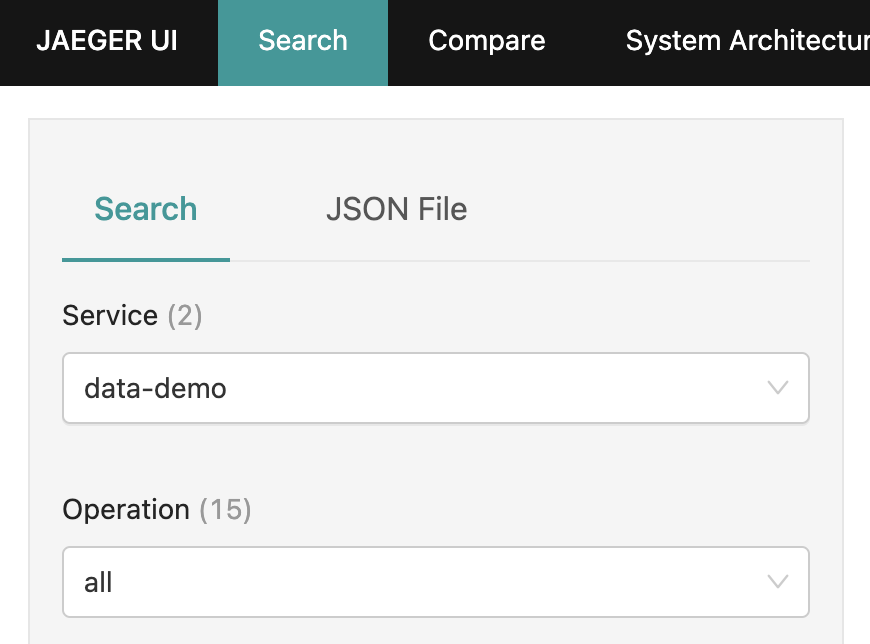
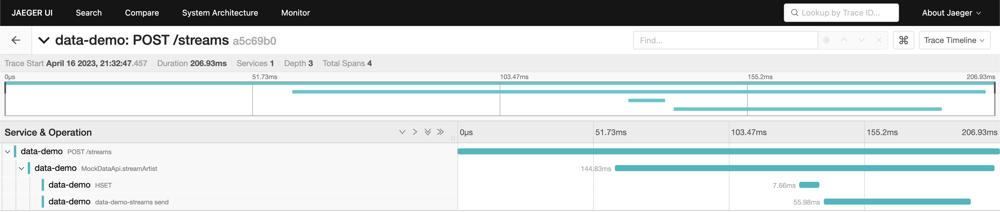
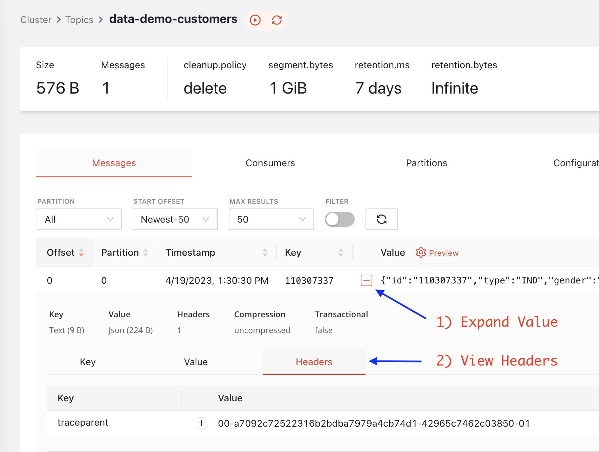
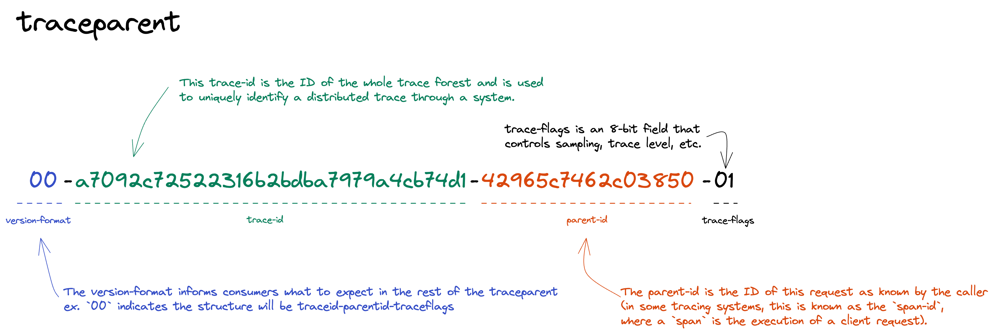
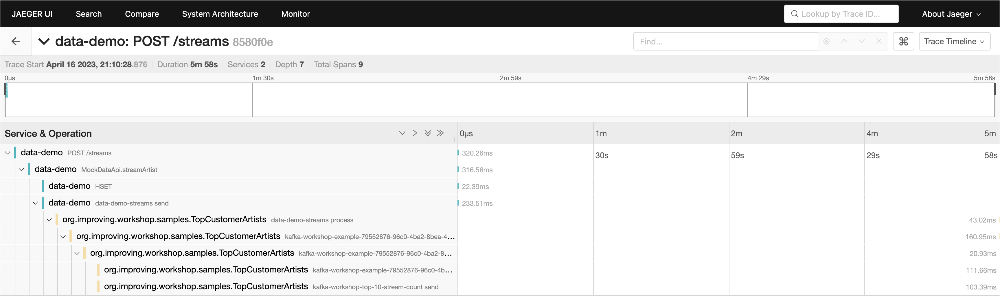
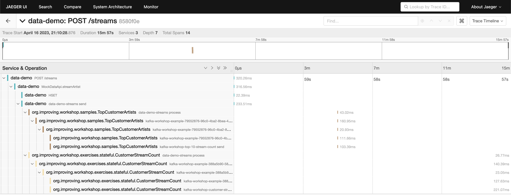

# Hands On: Observability

## Goals

1. Start Environment (Kafka + Observability)
2. Run `data-demo` and produce mock data
3. Run `stream-processing-workshop`
4. Explore distributed tracing data

### Start Kafka (Redpanda) Cluster

The data-demo project has a [kafka environment](https://github.com/schroedermatt/data-demo/blob/main/kafka/local/cluster/docker-compose-redpanda.yml) that can be started via Docker.

```bash
# run from the root of the data-demo repository
./gradlew kafkaComposeUp
```

Validate that Redpanda is up and running by navigating to [http://localhost:3000](http://localhost:3000)

### Start Observability Stack (Jaeger)

The data-demo project has an additional [observability environment](https://github.com/schroedermatt/data-demo/blob/main/observability/docker-compose.yml) that can be started via Docker. This includes Jaeger, a tracing backend and UI.

```bash
# run from the root of the data-demo repository
./gradlew tracingComposeUp

--

+----------+----------------+-----------------+
| Name     | Container Port | Mapping         |
+----------+----------------+-----------------+
| jaeger_1 | 16686          | localhost:16686 |
| jaeger_1 | 4317           | localhost:4317  |
| jaeger_1 | 4318           | localhost:4318  |
+----------+----------------+-----------------+
```

Validate that Jaeger is up and running by navigating to [http://localhost:16686](http://localhost:16686)

In the search panel on the left, you may see a "jaeger-query" service listed but you should not see anything else at this point.

### Run data-demo with Tracing Enabled

> See this [Hands On](https://github.com/schroedermatt/data-demo/blob/main/assets/01_hands-on-confluent.md) for additional details on cloning, configuring, and running [data-demo](https://github.com/schroedermatt/data-demo).

In the [gradle.properties](https://github.com/schroedermatt/data-demo/blob/main/gradle.properties#L5) file, update the `tracingEnabled` flag to `true`. [When true](https://github.com/schroedermatt/data-demo/blob/main/mockdata-api/build.gradle#L36-L45), the data-demo will start up with the otel java agent attached.

```properties
tracingEnabled=true
```

Start the mockdata-api.

```
# run from the root of the data-demo repository
./gradlew bootRunApi
```

### Produce Mock Data

1. Generate a Customer (also creates an Address, Email, and Phone linked to the Customer)

```bash
# create customer
curl --request POST --url http://localhost:8080/customers

## command output ##

{ 
  "customer": { "id":"015965944", .. },
  "address": { .. },
  "email": { .. },
  "phone": { .. }
}
```

2. Generate an Artist

```bash
# create artist
curl --request POST --url http://localhost:8080/artists

## command output ##

{
  "id": "825378672",
  "name": "Munch",
  "genre": "Pop"
}
```

3. Stream Artist (**Customer ID & Artist ID REQUIRED**)

> Use the Customer ID from step 1 and Artist ID from step 2 in the request body.

```bash
curl --request POST \
  --url http://localhost:8080/streams \
  --header 'Content-Type: application/json' \
  --data '{
	"customerid": "015965944",
	"artistid": "825378672"
  }'

## command output ##

{
  "id": "324373339",
  "customerid": "015965944",
  "artistid": "825378672",
  "streamtime": "2023-03-25T16:11:38.692121Z"
}
```

#### View Results in Jaeger

Open Jaeger (http://localhost:16686/) and select the `data-demo` service before clicking "Find Traces"



Select one of the "data-demo: POST" traces and view the results. There should be a trace for each of the API requests you made in the previous section.



This trace shows the event being generated and produced to Kafka.

#### View `traceparent` in Message Headers

Curious to see how the trace is being propogated between the services?

1. Jump back into [Redpanda Console](http://localhost:3000)
2. Navigate to the Topics page and select [`data-demo-customers`](http://localhost:3000/topics/data-demo-customers?o=-1&p=-1&q&s=50#messages)
3. Expand the Value (click the "+") of a message
4. Select the "Headers" tab



Notice the `traceparent` header (ex. 00-a7092c72522316b2bdba7979a4cb74d1-42965c7462c03850-01). There is a lot of information jammed into this value that is used (and propogated) by the OpenTelemetry instrumentation agents. An overview of the segments inside the traceparent is shown in the diagram below.



When you run a Stream or other client that processes a message, it will now be able to grab this `traceparent` header and propagate (report) the trace to Jaeger to continue building a picture of the end-to-end flow of the message.

### Run "Top Customer Artists" with Tracing Enabled

>  See this [Hands On](https://github.com/schroedermatt/data-demo/blob/main/assets/02_hands-on.md) for additional details on cloning, configuring, and running [stream-processing-workshop](https://github.com/schroedermatt/stream-processing-workshop).

In the [gradle.properties](https://github.com/schroedermatt/stream-processing-workshop/blob/main/gradle.properties#L2) file of the stream-processing-workshop project, update the `tracingEnabled` flag to `true`.  [When true](https://github.com/schroedermatt/stream-processing-workshop/blob/main/build.gradle#L27-L36), the Stream(s) will start up with the otel java agent attached.

```properties
tracingEnabled=true
```

Run the `TopCustomerArtists` stream.

```
# run from the root of the stream-processing-workshop
./gradlew -Pstream=org.improving.workshop.samples.TopCustomerArtists run
```

#### View Results in Jaeger

Open Jaeger (http://localhost:16686/) again and notice that `TopCustomerArtists` is now listed as a service. Select it before clicking "Find Traces".

Select a trace and view the results. Notice that the trace now extends from the origin (data-demo) all the way into the consuming service and you can see the full path. **COOL!**



### Run "Customer Stream Count" with Tracing Enabled

Let's take it one step further to see what happens when multiple consumers/streams process the same event. The Customer Stream Count can be found on the `solutions` branch so you'll first need to checkout that branch before running the Stream.

> Before continuing, double check that the `tracingEnabled` flag is `true` in [gradle.properties](https://github.com/schroedermatt/stream-processing-workshop/blob/main/gradle.properties#L2)

```bash
# run from the root of the stream-processing-workshop
git checkout solutions

./gradlew -Pstream=org.improving.workshop.exercises.stateful.CustomerStreamCount run
```

#### View Results in Jaeger

Open Jaeger (http://localhost:16686/) again and notice that CustomerStreamCount is now listed as a service. Select it before clicking "Find Traces".

Select a trace and view the results. Notice that the trace now extends from the origin (data-demo) all the way into MULTIPLE consuming services. **SWEET!**



### Cleanup

Now that your endorphins are flowing, it's time to tear down the environment (if you're done playing around).

```bash
# run from the root of the data-demo repository

# tear down jaeger
./gradlew tracingComposeDown

# tear down kafka (redpanda)
./gradlew kafkaComposeDown
```