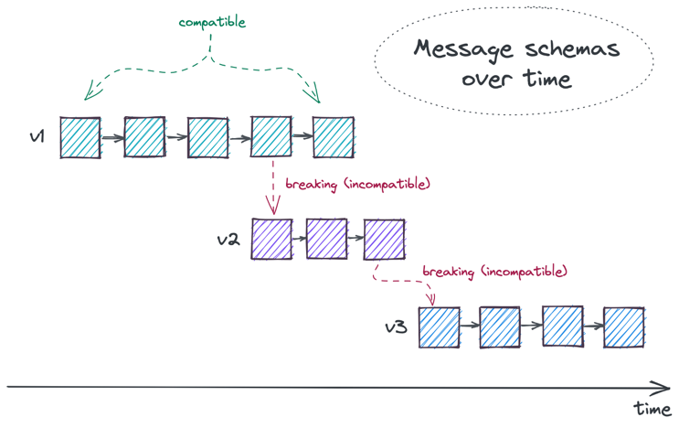

# Hands On: Schema Registry

> NOTE: `git pull` on data-demo's `main` branch before continuing!

## Goals

* Start Environment (Kafka + Schema Registry)
* Register Schema(s) & Explore Schema Registry API
* Produce & Consume Avro Data
* Examine Compatibility Options

## 1) Start Local Kafka Cluster

We'll start by firing up the single node Kafka cluster.

1. Start Docker (if not already started)
2. Start [Kafka 1 Stack](https://github.com/schroedermatt/data-demo/blob/main/kafka/local/kafka-1/docker-compose.yml) - this is a simplified stack to ease the load on your machine
    - This leverages the [`docker-compose` Gradle plugin](https://github.com/avast/gradle-docker-compose-plugin) ([configuration](https://github.com/schroedermatt/data-demo/blob/main/build.gradle#L52-L57))

```bash  
# run from root dir of data-demo    
./gradlew kafka1ComposeUp  
```  

3. Validate Cluster Startup with `docker ps`

```bash  
docker ps  

## command output (first 2 columns shown) ##    
CONTAINER ID   IMAGE  
25ca84ed77af   confluentinc/cp-kafka-connect:7.5.1
8616e0532f0f   confluentinc/cp-kafka:7.5.1
5e2078710584   confluentinc/cp-schema-registry:7.5.1
b6da33fb1854   redis:6.2-alpine
```

## 2) 👋 Hello, Schema Registry

Oh, and we have [Schema Registry](https://docs.confluent.io/platform/current/schema-registry/index.html)!

Schema Registry exposes a RESTful API. Let's validate that's up as well with a couple commands via your terminal.

```bash
# see all registered subjects (schemas) -- there shouldn't be any yet
curl -X GET http://localhost:8081/subjects

[]

--

# get the schema registry config (compatibility type) -- defaults to BACKWARD
curl -X GET http://localhost:8081/config

{
  "compatibilityLevel": "BACKWARD"
}
```

## 3) Register Schema

Here's a simple Avro schema with 3 required fields, fname, lname, and age.

```json
{
    "type": "record",
    "namespace": "org.msse.mockdata",
    "name": "User",
    "fields": [
        { "name": "fname", "type": "string" },
        { "name": "lname", "type": "string" },
        { "name": "age", "type": "int" }
    ]
}
```

Register the schema under the subject `"user-v1"`. You can think of Schema Registry as a key/value store where the "subject" is the key.

**Run the `curl` below from the root of `data-demo` as it references a schema file in `/assets`.**

```bash
# run from the root of the data-demo project
curl -X POST -H "Content-Type: application/vnd.schemaregistry.v1+json" \
    -d @assets/avro/user.v1.0.avro \
    http://localhost:8081/subjects/user-v1/versions

{ "id":1 }
```

## 4) Explore Schema Registry API

The Schema Registry API allows you to easily explore what's registered. Here are 4 common endpoints you can call to explore what's in the registry.

Try each of these -

```bash
# get all available subjects (schemas)
curl -X GET http://localhost:8081/subjects

[ "user-v1" ]

--
# get the registered versions for a specific subject
curl -X GET http://localhost:8081/subjects/user-v1/versions

[ 1 ]

-- 
# get a specific registered version of a subject
curl -X GET http://localhost:8081/subjects/user-v1/versions/1

{
  "id": 1,
  "version": 1,
  "subject": "user-v1",
  "schema": "{...}"
}

-- 
# get a specific registered version's schema for a subject
curl -X GET http://localhost:8081/subjects/user-v1/versions/1/schema

{
  "type": "record",
  "name": "User",
  "namespace": "org.msse.mockdata",
  "fields": [ .. ]
}
```

## 5) Produce & Consume Avro

Now that the schema is registered, we can produce & consume events that abide by the Avro schema. 

The `kafka-avro-console-producer` & `kafka-avro-console-consumer` CLIs are baked into the schema-registry Docker container. We are going to `exec` onto the container to run the CLI commands.

First, produce an Avro event with the command below. We are going to specifically target the schema that was previously registered by id (`value.schema.id=1`). You can also supply the schema when producing the event and it can be registered during the event production lifecycle.

```shell
./kafka-bin/kafka-avro-console-producer --topic test.topic.avro --property value.schema.id=1

# copy the below sample, paste into the terminal and hit enter
{"fname":"john", "lname": "doe", "age": 50}

# now break it by pasting json that's missing 'age'
{"fname":"john", "lname": "doe"}

## somewhere in the logs you'll see
org.apache.kafka.common.errors.SerializationException: Error deserializing json {"fname":"john", "lname": "doe"} to Avro of schema {"type":"record","name":"User","namespace":"org.msse.mockdata","fields":[{"name":"fname","type":"string"},{"name":"lname","type":"string"},{"name":"age","type":"int"}]}
...
...
```

If you provide JSON that doesn't align with the schema, the `kafka-avro-console-producer` will crash with a 1/2 useful error message (I wish it did a little better job of explaining why it crashed but 🤷‍)

Now, consume the Avro event!

```shell
./kafka-bin/kafka-avro-console-consumer --topic test.topic.avro --from-beginning

## these CLIs are tied to a small java app behind the scenes, so the logs are pretty verbose

{"fname":"john","lname":"doe","age":50}

# Ctrl + C to exit
```

Unable to run the kafka-bin commands? Here are the `docker exec` commands running within the helper scripts.

```shell
# kafka-avro-console-producer
docker exec -it kafka1_schema-registry kafka-avro-console-producer --bootstrap-server broker-1:9092 --property schema.registry.url=http://localhost:8081 --topic test.topic.avro --property value.schema.id=1
# kafka-avro-console-consumer
docker exec -it kafka1_schema-registry kafka-avro-console-consumer --bootstrap-server broker-1:9092 --property schema.registry.url=http://localhost:8081 --topic test.topic.avro --from-beginning
```

## 6) Register a Compatible Schema Change

Whoops! Our initial schema wasn't complete. We don't need `age` and we forgot middle name (`mname`). Let's make these edits and register a new version.

**COMPATIBILITY TYPE RECAP**

> BACKWARD (the default) compatibility allows the deletion of fields (required or optional) and addition of OPTIONAL fields.

> FORWARD Compatibility allows the deletion of OPTIONAL fields and addition of fields (required or optional).

```json
{
  "type": "record",
  "namespace": "org.msse.mockdata",
  "name": "User",
  "fields": [
      { "name": "fname", "type": "string" },
      { "name": "lname", "type": "string" },
      { "name": "mname", "type": ["null", "string"], "default": "null" }
  ]
}
```

Register the `user.v1.1.avro` schema under the same subject `"user-v1"`. This will result in a new version being created.

**Once again, run the below command from the root of the `data-demo` project.**

```bash
# run from the root of the data-demo project
curl -X POST -H "Content-Type: application/vnd.schemaregistry.v1+json" \
    -d @assets/avro/user.v1.1.avro \
    http://localhost:8081/subjects/user-v1/versions

{ "id": 2 }
```

Now we can produce/consume data aligned to either version of the schema.

```bash
# get available versions for the subject (schema)
curl -X GET http://localhost:8081/subjects/user-v1/versions

[ 1, 2 ]

# check out the newly registered schema version
curl -X GET http://localhost:8081/subjects/user-v1/versions/2/schema
```

Produce an event tied to the latest schema (id=2).

```shell
./kafka-bin/kafka-avro-console-producer --topic test.topic.avro --property value.schema.id=2

# copy the below sample, paste and hit enter
{"fname":"john","lname":"doe","mname":{"string":"lee"}}

# Ctrl + C to exit
```

Wondering why `mname` in our sample was structured as `"mname":{"string":"lee"}`?

Avro's JSON encoding requires that non-null union values be tagged with their intended type. 
This is because unions like ["bytes","string"] and ["int","long"] are ambiguous in JSON, the first
are both encoded as JSON strings, while the second are both encoded as JSON numbers.

## 7) Register an Incompatible Schema Change

We forgot something else, everyone **has to** have a nickname! Let's add a new **required** field, `nickname`.

Our schema now looks like this -

```json
{
  "type": "record",
  "namespace": "org.msse.mockdata",
  "name": "User",
  "fields": [
      { "name": "fname", "type": "string" },
      { "name": "lname", "type": "string" },
      { "name": "mname", "type": ["null", "string"], "default": "null" },
      { "name": "nickname", "type": "string" }
  ]
}
```

However, if you try to register it, you'll get back a `409` with a message explaining that the new field needs to have a default due to the `BACKWARD` compatibility type being in use.

```bash
# run from the root of data-demo
curl -X POST -H "Content-Type: application/vnd.schemaregistry.v1+json" \
    -d @assets/avro/user.v2.0.avro \
    http://localhost:8081/subjects/user-v1/versions

{
  "error_code": 409,
  "message": "Schema being registered is incompatible with an earlier schema for subject \"user-v1\", 
    details: [
      Incompatibility{type:READER_FIELD_MISSING_DEFAULT_VALUE, 
      location:/fields/4, 
      message:nickname, 
      reader:{..}
    ]"
}
```

If you were planning to automate the schema registry process, you might first add a compatibility check. This can be done directly through the compatibility API.

The below command is checking the compatibility of our schema with the required `nickname` field against the latest registered version (2).

```bash
curl -X POST -H "Content-Type: application/vnd.schemaregistry.v1+json" \
    -d @assets/avro/user.v2.0.avro \
    http://localhost:8081/compatibility/subjects/user-v1/versions/latest
  
{
  "is_compatible": false
}
```

So how do we get this incompatible schema update registered? There are a couple options.

1. Register the breaking schema under a new subject, `user-v2`. This breaks the versioning chain of the previous subject and creates an entirely new subject starting at version 1 (see image below for a visual of compatible vs incompatible changes).

```bash
# register a new 'data-demo-customers-avro-v2-value' subject
curl -X POST -H "Content-Type: application/vnd.schemaregistry.v1+json" \
    -d @assets/avro/user.v2.0.avro \
    http://localhost:8081/subjects/user-v2/versions
    
{ "id":3 }
```



2. Update the compatibility type for the subject (or globally) to `FORWARD` (allow the deletion of OPTIONAL fields and addition of fields) and register the schema under the same `"user-v1"` subject.

```bash
# update the compatibility for a single subject
curl -X PUT -H "Content-Type: application/vnd.schemaregistry.v1+json" \
    --data '{"compatibility": "FORWARD"}' \
    http://localhost:8081/config/user-v1
    
{
  "compatibility":"FORWARD"
}

--

# register the schema under the 'user-v1' subject (NOT a new v2 subject) 
curl -X POST -H "Content-Type: application/vnd.schemaregistry.v1+json" \
    -d @assets/avro/user.v2.0.avro \
    http://localhost:8081/subjects/user-v1/versions

{ "id":3 }

--

# you can also update compatibility requirements globally
curl -X PUT -H "Content-Type: application/vnd.schemaregistry.v1+json" \
    --data '{"compatibility": "FORWARD"}' \
    http://localhost:8081/config
```

## 8) Cleanup

When you're done, feel free to tear down the environment.

```bash
./gradlew kafka1ComposeDown
```